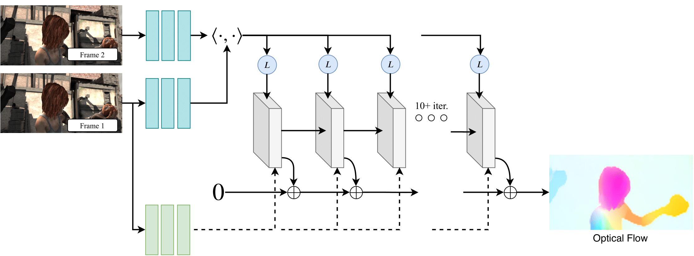

# RAFT
本仓库包含我们论文的源码：

[RAFT: Recurrent All Pairs Field Transforms for Optical Flow](https://arxiv.org/pdf/2003.12039.pdf)<br/>
ECCV 2020 <br/>
Zachary Teed 和 Jia Deng<br/>



## 环境要求
代码已在 PyTorch 1.6 和 Cuda 10.1 下测试通过。
```Shell
conda create --name raft
conda activate raft
conda install pytorch=1.6.0 torchvision=0.7.0 cudatoolkit=10.1 matplotlib tensorboard scipy opencv -c pytorch
```

## 演示
可通过运行以下命令下载预训练模型：
```Shell
./download_models.sh
```
或从 [google drive](https://drive.google.com/drive/folders/1sWDsfuZ3Up38EUQt7-JDTT1HcGHuJgvT?usp=sharing) 下载。

你可以在一段连续帧上演示已训练模型：
```Shell
python demo.py --model=models/raft-things.pth --path=demo-frames
```

## 所需数据
要评估/训练 RAFT，你需要下载以下数据集：
* [FlyingChairs](https://lmb.informatik.uni-freiburg.de/resources/datasets/FlyingChairs.en.html#flyingchairs)
* [FlyingThings3D](https://lmb.informatik.uni-freiburg.de/resources/datasets/SceneFlowDatasets.en.html)
* [Sintel](http://sintel.is.tue.mpg.de/)
* [KITTI](http://www.cvlibs.net/datasets/kitti/eval_scene_flow.php?benchmark=flow)
* [HD1K](http://hci-benchmark.iwr.uni-heidelberg.de/)（可选）

默认情况下，`datasets.py` 会在以下位置查找数据集。你可以在 `datasets` 文件夹中创建指向实际下载位置的符号链接：

```Shell
├── datasets
    ├── Sintel
        ├── test
        ├── training
    ├── KITTI
        ├── testing
        ├── training
        ├── devkit
    ├── FlyingChairs_release
        ├── data
    ├── FlyingThings3D
        ├── frames_cleanpass
        ├── frames_finalpass
        ├── optical_flow
```

## 评估
你可以使用 `evaluate.py` 对已训练模型进行评估：
```Shell
python evaluate.py --model=models/raft-things.pth --dataset=sintel --mixed_precision
```

## 训练
我们在论文中使用了如下训练流程（2 块 GPU）。训练日志会写入 `runs`，可使用 tensorboard 可视化：
```Shell
./train_standard.sh
```

如果你有 RTX GPU，可使用混合精度加速训练。在该设置下（1 块 GPU）通常可以获得相近结果：
```Shell
./train_mixed.sh
```

## （可选）高效实现
你也可以通过编译提供的 cuda 扩展，使用我们的替代版（高效）实现：
```Shell
cd alt_cuda_corr && python setup.py install && cd ..
```
然后在运行 `demo.py` 和 `evaluate.py` 时添加 `--alternate_corr` 参数。注意：该实现相比 all-pairs 略慢，但在前向传播时显著减少 GPU 显存占用。
